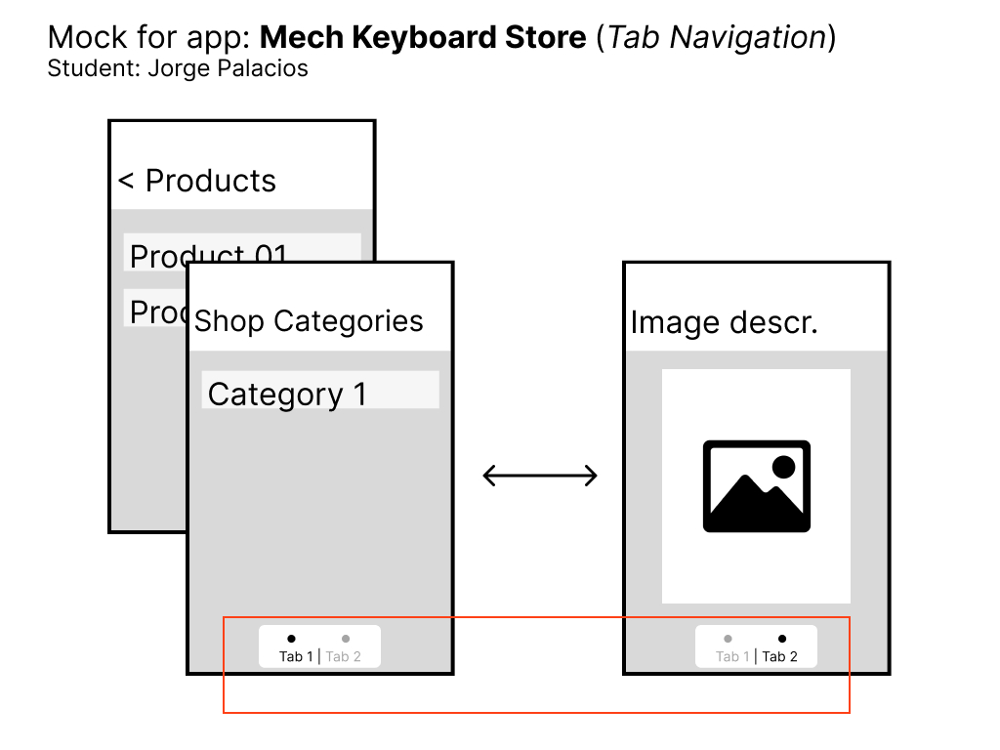

# Challenge: Views and Navigation

Jorge Palacios

## Description

### Idea

The main goal of this exercise was to comply with the challenge's requirements in terms of having a couple of screens and navigating between them using a Navigator stack as shown in class.

Besides, it was an opportunity to tinker with `ImageBackground` and the `TouchableOpacity` components to create some kind of graphic button.

Finally, I wanted to tinker a little bit with the `FlatList` component, even in its most basic form.

### Challenges

I wanted to have an "Image Button" inside the `FlatList` component and show a product detail screen. However, it wasn't possible as I had some challenges to expand it successfully.

## Mock

Finally, as requested, please find attached the mock.

